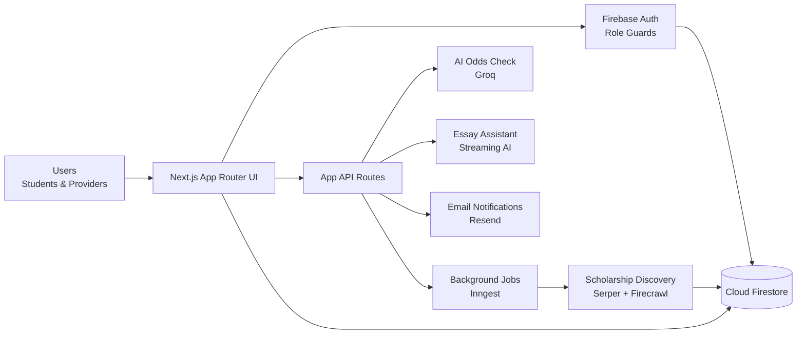
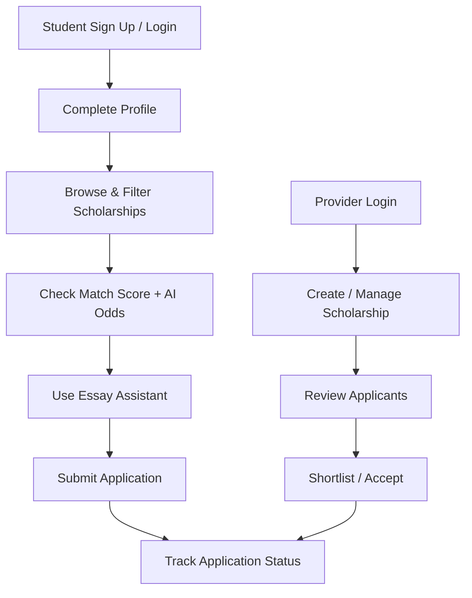

# 🌸 FundHerFuture (FundForHer)

> Empowering women in India with accessible scholarship discovery, smart matching, and application support.

[](https://nextjs.org/)
[](https://react.dev/)
[](https://firebase.google.com/)
[](https://www.typescriptlang.org/)

---

## 📌 Quick Navigation

- [✨ Overview](#-overview)
- [🚀 Feature Highlights](#-feature-highlights)
- [🧱 Architecture Diagram](#-architecture-diagram)
- [🔄 User Journey Flow](#-user-journey-flow)
- [🛠️ Tech Stack](#️-tech-stack)
- [📂 Key App Areas](#-key-app-areas)
- [🧪 Local Development](#-local-development)
- [📜 Available Scripts](#-available-scripts)
- [🎯 Mission](#-mission)

---

## ✨ Overview

**FundHerFuture** is a scholarship platform focused on helping female students:
- discover relevant opportunities,
- evaluate scholarship fit and eligibility,
- apply efficiently,
- and track application progress.

It also provides dedicated **provider workflows** for posting scholarships and managing applicants.

---

## 🚀 Feature Highlights

### 👩‍🎓 Student Experience
- 🔎 Scholarship discovery with advanced filters
- 📊 Match scoring using profile data
- 🤖 AI-powered scholarship odds analysis
- ✍️ AI essay assistant for application writing support
- 🔖 Bookmark and save scholarships
- 📝 Application tracking and status monitoring
- 👥 Community and mentorship areas
- 🙋 Profile editing + document vault
- 🧪 Feedback and bug reporting forms

### 🏢 Provider Experience
- 📌 Provider authentication and protected dashboard
- 🎯 Scholarship creation, editing, and publishing
- 📈 KPI-driven dashboard visibility
- 🗂️ Applicant review workflows (kanban-style management)
- 🗑️ Scholarship deletion with associated application cleanup

### ⚙️ Platform Capabilities
- 🔐 Firebase auth with role-based route protection
- ☁️ Firestore-backed data and workflows
- 📱 PWA support + Android flow via Capacitor
- 📬 Notification integration through Resend
- 🧠 AI + automation stack (Groq, Genkit, Inngest)
- 🛰️ Monitoring and observability with Sentry

---

## 🧱 Architecture Diagram



---

## 🔄 User Journey Flow



---

## 🛠️ Tech Stack

- **Frontend:** Next.js 16, React 19, TypeScript, Tailwind CSS, Radix UI
- **Backend Services:** Firebase (Auth, Firestore, Storage)
- **AI:** AI SDK + Groq, Genkit
- **Automation:** Inngest + scraper pipeline
- **Mobile/PWA:** `next-pwa`, Capacitor (Android)
- **Observability:** Sentry

---

## 📂 Key App Areas

- `/` → Landing page and mission narrative
- `/authenticated/*` → Student dashboard and application workflows
- `/provider/*` → Provider auth and scholarship management
- `/app/api/*` → API endpoints for AI, notifications, sync, and jobs

---

## 🧪 Local Development

### 1) Prerequisites
- Node.js 20+
- npm
- Firebase project credentials

### 2) Install dependencies

```bash
npm install
```

### 3) Configure environment variables
Create `.env.local` in the project root and set required values, including:

- `NEXT_PUBLIC_FIREBASE_API_KEY`
- `NEXT_PUBLIC_FIREBASE_AUTH_DOMAIN`
- `NEXT_PUBLIC_FIREBASE_PROJECT_ID`
- `NEXT_PUBLIC_FIREBASE_STORAGE_BUCKET`
- `NEXT_PUBLIC_FIREBASE_MESSAGING_SENDER_ID`
- `NEXT_PUBLIC_FIREBASE_APP_ID`
- `NEXT_PUBLIC_FIREBASE_MEASUREMENT_ID` (optional)
- `FIREBASE_PRIVATE_KEY`
- `FIREBASE_CLIENT_EMAIL`
- `FIREBASE_PROJECT_ID`
- `GROQ_API_KEY`
- `GEMINI_API_KEY` / `GEMINI_API_KEYS` / `GOOGLE_API_KEY` (if used)
- `RESEND_API_KEY`
- `DEVELOPER_EMAIL`
- `CRON_SECRET`
- `SERPER_API_KEY`
- `FIRECRAWL_API_KEY`
- `ALGOLIA_APP_ID`
- `ALGOLIA_ADMIN_KEY`
- `CLOUDFLARE_ACCOUNT_ID`
- `CLOUDFLARE_API_TOKEN`

### 4) Run locally

```bash
npm run dev
```

Open: `http://localhost:3000`

---

## 📜 Available Scripts

- `npm run dev` – start development server
- `npm run build` – create production build
- `npm run start` – run production build
- `npm run lint` – run Next.js lint checks
- `npm run typecheck` – run TypeScript checks
- `npm run genkit:dev` – start Genkit dev server
- `npm run genkit:watch` – start Genkit in watch mode
- `npm run build:android` – Android build/sync flow

---

## 🎯 Mission

FundHerFuture exists to reduce financial barriers and improve scholarship access for women through technology, guidance, and opportunity matching.
