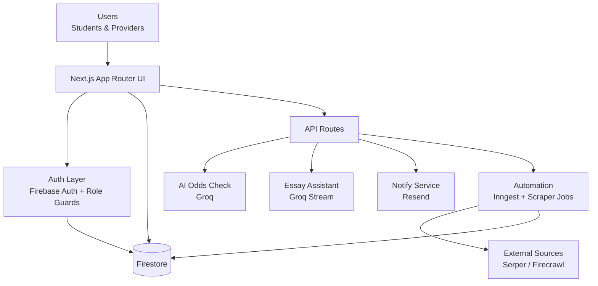

# 🌸 FundHerFuture (FundForHer)

> Empowering women in India with accessible scholarship discovery, matching, and application support.

[](https://nextjs.org/)
[](https://react.dev/)
[](https://firebase.google.com/)
[](https://www.typescriptlang.org/)

---

## ✨ Overview

**FundHerFuture** is a scholarship platform focused on helping female students:
- discover relevant scholarships,
- evaluate fit and eligibility,
- apply efficiently,
- and track their progress.

The project also includes dedicated **provider workflows** for posting scholarships and reviewing applicants.

---

## 🚀 Core Features

### 👩‍🎓 Student Features
- 🔎 Scholarship discovery with filters (field, eligibility, type, location, etc.)
- 📊 Match scoring against profile data
- 🤖 AI-powered scholarship odds analysis
- ✍️ AI essay assistant for scholarship applications
- 🔖 Bookmark/save scholarships
- 📝 Application tracking and status views
- 👥 Community and mentorship sections
- 🙋 Profile management and document vault
- 🧪 Feedback and bug reporting forms

### 🏢 Provider Features
- 📌 Provider authentication and protected dashboard
- 🎯 Scholarship creation, editing, and publishing
- 📈 KPI-driven dashboard insights
- 🗂️ Applicant review workflows (including kanban-style management)
- 🗑️ Scholarship deletion with associated application cleanup

### ⚙️ Platform Features
- 🔐 Firebase authentication + role-based access control
- ☁️ Firestore-backed data model
- 📱 PWA support and Android build path (Capacitor)
- 📬 Notification/email endpoint integration (Resend)
- 🧠 AI + automation infrastructure (Genkit, Groq, Inngest)
- 🛰️ Monitoring hooks via Sentry

---

## 🧱 High-Level Architecture



---

## 🛠️ Tech Stack

- **Frontend:** Next.js 16, React 19, TypeScript, Tailwind CSS, Radix UI
- **Backend Services:** Firebase (Auth, Firestore, Storage)
- **AI:** AI SDK + Groq, Genkit
- **Jobs/Automation:** Inngest, scholarship scraping pipeline
- **Mobile/PWA:** next-pwa, Capacitor (Android)
- **Observability:** Sentry

---

## 📂 Key App Areas

- `/` – Landing page and project story
- `/authenticated/*` – Student dashboard and student workflows
- `/provider/*` – Provider login/registration and provider dashboard
- `/app/api/*` – API routes (AI, notifications, sync, automation)

---

## 🧪 Local Development

### 1) Prerequisites
- Node.js 20+
- npm
- Firebase project credentials

### 2) Install

```bash
npm install
```

### 3) Configure environment variables
Create `.env.local` in the project root and set the required values used by this repo, including:

- `NEXT_PUBLIC_FIREBASE_API_KEY`
- `NEXT_PUBLIC_FIREBASE_AUTH_DOMAIN`
- `NEXT_PUBLIC_FIREBASE_PROJECT_ID`
- `NEXT_PUBLIC_FIREBASE_STORAGE_BUCKET`
- `NEXT_PUBLIC_FIREBASE_MESSAGING_SENDER_ID`
- `NEXT_PUBLIC_FIREBASE_APP_ID`
- `NEXT_PUBLIC_FIREBASE_MEASUREMENT_ID` (optional)
- `FIREBASE_PRIVATE_KEY`
- `FIREBASE_CLIENT_EMAIL`
- `FIREBASE_PROJECT_ID`
- `GROQ_API_KEY`
- `GEMINI_API_KEY` / `GEMINI_API_KEYS` / `GOOGLE_API_KEY` (if applicable)
- `RESEND_API_KEY`
- `DEVELOPER_EMAIL`
- `CRON_SECRET`
- `SERPER_API_KEY`
- `FIRECRAWL_API_KEY`
- `ALGOLIA_APP_ID`
- `ALGOLIA_ADMIN_KEY`
- `CLOUDFLARE_ACCOUNT_ID`
- `CLOUDFLARE_API_TOKEN`

### 4) Run

```bash
npm run dev
```

Open `http://localhost:3000`.

---

## 📜 Available Scripts

- `npm run dev` – Start local development server
- `npm run build` – Create production build
- `npm run start` – Run production server
- `npm run lint` – Run Next.js lint checks
- `npm run typecheck` – Run TypeScript type checking
- `npm run genkit:dev` – Start Genkit dev server
- `npm run genkit:watch` – Start Genkit with watch mode
- `npm run build:android` – Build/sync Android package flow

---

## 🤝 Contributing

1. Fork the repository
2. Create a feature branch
3. Commit clear, focused changes
4. Open a pull request

---

## 📌 Mission

FundHerFuture exists to reduce financial barriers and improve scholarship access for women through technology, guidance, and opportunity matching.
